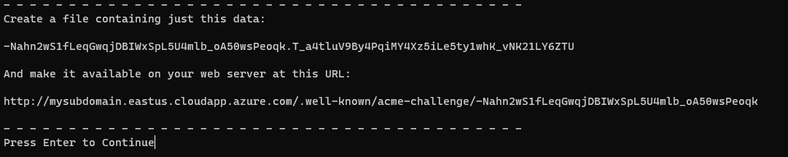

# Certificate Generation for an Azure Public IP with your DNS Prefix

In Azure there are services that do not support self-signed certificates (Ex. Azure Front Door).  In order to do some testing on Azure, we can create a public and valid CA certificate for free. This article allows you generate a CA certificate for your Public IP's domain prefix (i.e. `your-prefix.the-region.cloudapp.azure.com`).

It is based on [Let's Encrypt®](https://letsencrypt.org). Let's Encrypt is a non-profit certificate authority run by Internet Security Research Group (ISRG) that provides X.509 certificates for Transport Layer Security (TLS) encryption at no charge.
## Prerequisites

1. An Azure subscription. If you don't have an Azure subscription, you can create a [free account](https://azure.microsoft.com/free).
1. [Install Certbot](https://certbot.eff.org). Certbot is a free, open source software tool for automatically using Let’s Encrypt certificates on manually-administrated websites to enable HTTPS.
1. [Install OpenSSL](https://www.openssl.org) command line tool. OpenSSL is a robust, commercial-grade, and full-featured toolkit for the Transport Layer Security (TLS) and Secure Sockets Layer (SSL) protocols. It is also a general-purpose cryptography library.
1. [Install Azure CLI](https://docs.microsoft.com/cli/azure/install-azure-cli?view=azure-cli-latest) or you can perform this from Azure Cloud Shell by clicking below.

   [](https://shell.azure.com)

## Steps

- Log in to your Azure account and select the subscription.

   ```bash
   ## Login into Azure and set your subscription

   az login
   az account set -s <subscription-id>
   ```

- :rocket: Create the Azure resources  

   In order to create a certificate we need to demonstrate domain ownership. We are going to use an Azure Application Gateway on top of Azure Blob storage to do that.

   ```bash
   # Your resource group name
   RGNAME=rg-lets-encrypt-cert-validator
   
   # Azure location of the domain
   LOCATION=eastus
   
   # Your subdomain (prefix) name
   DOMAIN_NAME=mysubdomain
   
   # Set your domain name
   FQDN="${DOMAIN_NAME}.${LOCATION}.cloudapp.azure.com"
   
   # Optional, you can use a pre-existing Public IP with the prior dns name set.
   # PUBLIC_IP_RESOURCE_ID=
   
   # Resource group creation
   az group create -n $RGNAME -l $LOCATION
   
   # Resource deployment. Public IP (with DNS prefix), Virtual Network, Storage Account and Application Gateway
   az deployment group create -g $RGNAME -f resources-stamp.bicep --name cert-0001 -p location=${LOCATION} subdomainName=${DOMAIN_NAME} #ipResourceId=${PUBLIC_IP_RESOURCE_ID}
   
   # Get the Azure Storage Account name
   STORAGE_ACCOUNT_NAME=$(az deployment group show -g $RGNAME -n cert-0001 --query properties.outputs.storageAccountName.value -o tsv)
   
   # Enable web hosting on the storage account (cannot be done via ARM)
   az storage blob service-properties update --account-name $STORAGE_ACCOUNT_NAME --static-website true --auth-mode login
   ```

- :heavy_plus_sign: Upload test validation file, used to test connectivity and routing of Azure Application Gateway

   ```bash
   # Create a local test file
   echo pong>ping.txt
   
   # Upload that file
   az storage blob upload --account-name $STORAGE_ACCOUNT_NAME -c \$web -n ping -f ./ping.txt --auth-mode login
   ```

- :heavy_check_mark: Checking if the resources created are working

   ```bash
   # Validate you can access the file directly from storage (should see "pong")
   curl "$(az storage account show -g $RGNAME -n $STORAGE_ACCOUNT_NAME --query primaryEndpoints.web -o tsv)/ping"
   
   # The Azure Application Gateway is exposing the file properly (should see "pong")
   curl http://${FQDN}/ping
   
   # The Azure Application Gateway rewrite rule is working for Let's Encrypt (should see "pong")
   curl http://${FQDN}/.well-known/acme-challenge/ping
   ```

- :key: Generate certificate by using [Certbot](https://certbot.eff.org/)

   Execute a command like the following with administration privilege.

   ```bash
   certbot certonly --email changeme@mail.com --agree-tos --manual --manual-auth-hook "./authenticator.sh ${STORAGE_ACCOUNT_NAME}" -d $FQDN --config-dir ./certs/etc/letsencrypt --work-dir ./certs/var/lib/letsencrypt --logs-dir ./certs/var/log/letsencrypt
   ```

   Before pressing Enter, you need to follow the Certbot instructions in another console window.

   

   1. Create a file name with the name presented by Certbot during the execution, with a `.txt` extension and add the content inside as instructed. For example,

   ```bash
   echo "-Nahn2wS1fLeqGwqjDBIWxSpL5U4mlb_oA50wsPeoqk.T_a4tluV9By4PqiMY4Xz5iLe5ty1whK_vNK21LY6ZTU">-Nahn2wS1fLeqGwqjDBIWxSpL5U4mlb_oA50wsPeoqk.txt
   ```

   1. Upload the generated file inside the _$web_ container in any way (by command line or azure portal as you prefer) Ex:

      ```bash
      az storage blob upload                                   \
        --account-name $STORAGE_ACCOUNT_NAME                   \
        -c \$web                                               \
        -n "-Nahn2wS1fLeqGwqjDBIWxSpL5U4mlb_oA50wsPeoqk"       \
        -f "./-Nahn2wS1fLeqGwqjDBIWxSpL5U4mlb_oA50wsPeoqk.txt" \
        --auth-mode login
      ```

   1. Test the url that certbot is expecting. (Should receive the text from above.)

      ```bash
      curl http://${FQDN}/.well-known/acme-challenge/-Nahn2wS1fLeqGwqjDBIWxSpL5U4mlb_oA50wsPeoqk
      ```

   1. If the test is working, please press Enter

   1. You should get a message that the cert was generated.

- :page_with_curl: We need to generate the pfx

   1. Generate pfx with or without password as you need

      ```bash
      cd ./certs/etc/letsencrypt/live/${FQDN}/

      # Password-less
      openssl pkcs12 -export -out ${DOMAIN_NAME}.pfx -inkey privkey.pem -in cert.pem -certfile chain.pem -passout pass:
      
      # Or with password
      openssl pkcs12 -export -out ${DOMAIN_NAME}.pfx -inkey privkey.pem -in cert.pem -certfile chain.pem
      ```

- :thumbsup: You have your CA valid pfx certificate for your domain on the directory.

   You will able to find `$DOMAIN_NAME.pfx` file on the current folder.

### :broom: Delete Azure resources

```bash
az group delete -n $RGNAME --yes
```

### :book: Generate more certificates

If you need to generate more certificates in *the same region*, before deleting the resources, you could:

1. Set the new values in the variables, Ex.

   ```bash
   FQDN=mysecondsubdomain.eastus.cloudapp.azure.com
   DOMAIN_NAME=mysecondsubdomain
   ```

1. In Azure Portal Change the name for the Public IP

   Public IP -> Configuration -> DNS name label  
   Set the same value than `$DOMAIN_NAME`

1. Go back to the root folder

   ```bash
   cd -
   ```

1. Start again on the step "Generate certificate base on [Certbot](https://certbot.eff.org/)"

## Scripting certificate generation

It is an option to generate the certificate running a script which will execute automatically all for you. It will generate `subdomain.pfx` in your directory. All the resources are created, then the certificate is generated, and finally the resources are deleted. The script generates the certificate for a PIP (Public IP) which already exist.

```bash
./generate-cert.sh <Existing PIP resource Id>
```
## Contributions

Please see our [contributor guide](./CONTRIBUTING.md).

This project has adopted the [Microsoft Open Source Code of Conduct](https://opensource.microsoft.com/codeofconduct/). For more information see the [Code of Conduct FAQ](https://opensource.microsoft.com/codeofconduct/faq/) or contact <opencode@microsoft.com> with any additional questions or comments.

With :heart: from Microsoft Patterns & Practices, [Azure Architecture Center](https://aka.ms/architecture).  
  
  
Let's Encrypt is a trademark of the Internet Security Research Group. All rights reserved.
